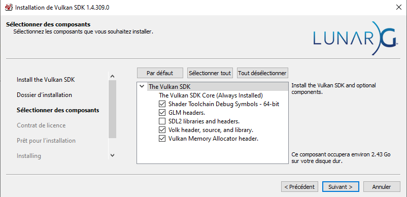

# VULKAN ENGINE 

Following the [vkguide.dev](https://vkguide.dev/) tutorial for now

Here is my results.

## HOW TO RUN MY CODE ?

1. Clone this repository.
2. Install [Vulkan](https://vulkan.lunarg.com/sdk/home#windows)
3. Check thoses parameters during installation 

4. Run my code.
